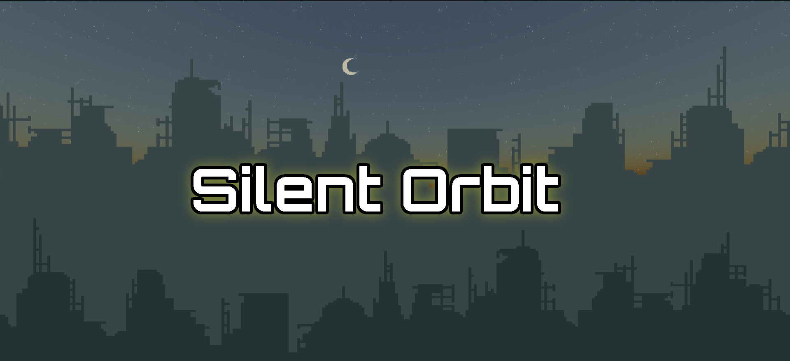

# Silent Orbit

Silent Orbit is a 2D platformer game built with Three.js

## Run the Game
Download the source, and run `Server.jar` and open `localhost:[port number from GUI]/index.html`

By default the port is `8080`, so you would go to `localhost:8080/index.html` to load the project

This assumes you have `Java 11` at minimum installed on your computer. 

## How to Play
Use the arrow keys to move around the level

# Report Bugs/Feature Requests
If you encounter any bugs or would like to suggest a feature, please report them to the [Issue Tracker](https://github.com/CowgillAlex/Silent-Orbit/issues).
